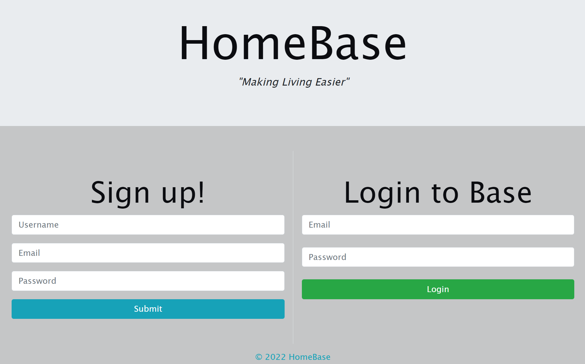
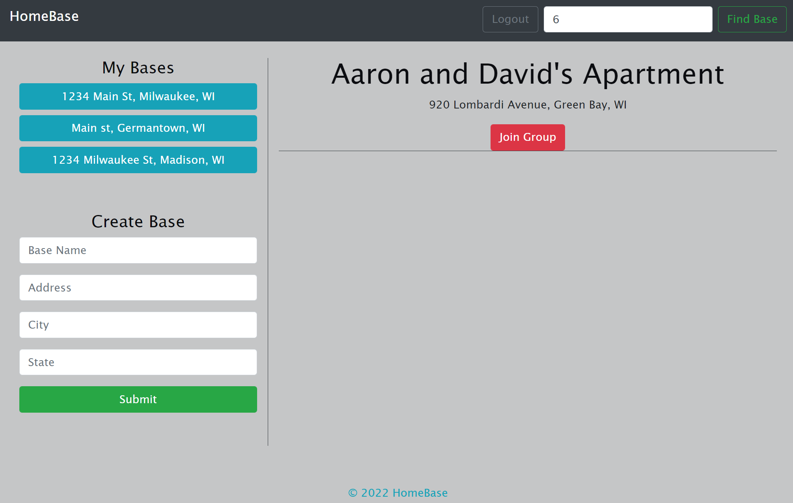
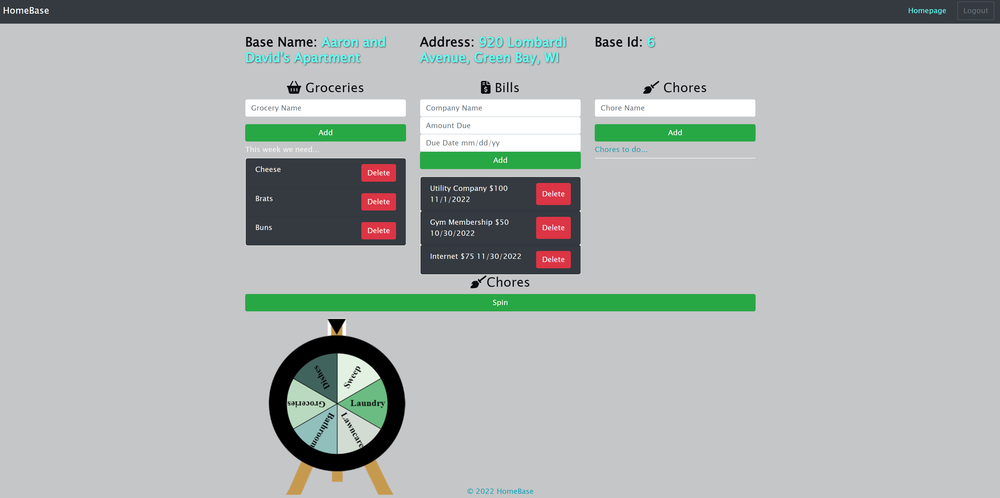

# HomeBase

## Description
HomeBase is a website designed to make living with roommates or significant others much easier. HomeBase enables our users to keep track of bills, groceries, and chores with their housemates. Users can create or join a base with their housemates. Once you're in your base's dashboard, you'll see any outstanding items as well as the option to create or delete groceries and bills as necessary. You'll also see a randomized chore wheel which is great for distributing chores to ensure it never gets stale! Users can be a part of more than one base at a time. Going out of town with a friend? Create a base to keep track of expenses!

## Installation
HomeBase is deployed live using the Heroku hosting service. No installation is required for the user. The website is accessible and fully functional from any web browser or mobile device.

## Usage
When the user reaches the HomeBase landing page, they'll be given the choice to either create a new account or sign in with an existing account. Once you're logged in you'll be redirected to the homepage where you'll see your existing bases on the left side of the screen as well as an option to create new bases. In the upper right corner you'll find a search bar used to join a base another user has created. Search the base id number that is assigned and displayed on the base's dashboard. The group details will generate with a button to join the base. When you're on the base's dashboard, existing groceries and bills will be displayed along with the option to create a new item. Simply fill in the required fields and the item will be created. New items are instantly visable to all users who have joined the base! A simple click on the chore wheel will start the spin. In the navbar at the top of the screen you'll see options to return to your homepage or logout when finished.

 
 

 
 

 
 

## Credits
HomeBase is proudly created and maintained by Alex, Autumn, Gestan, Kelsie, Olivia, and Sam.
 

 

 

 

 

 

 

 

 

